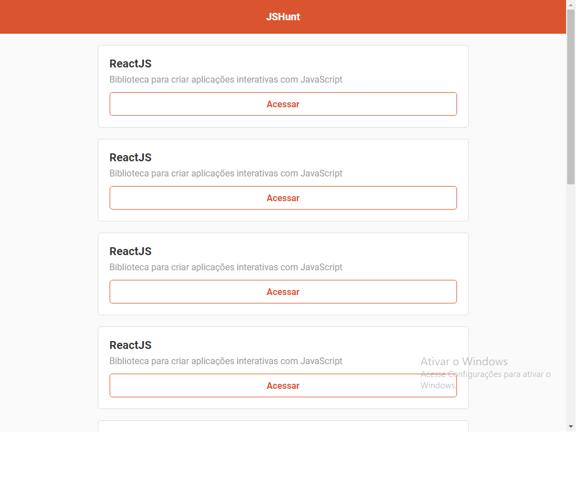
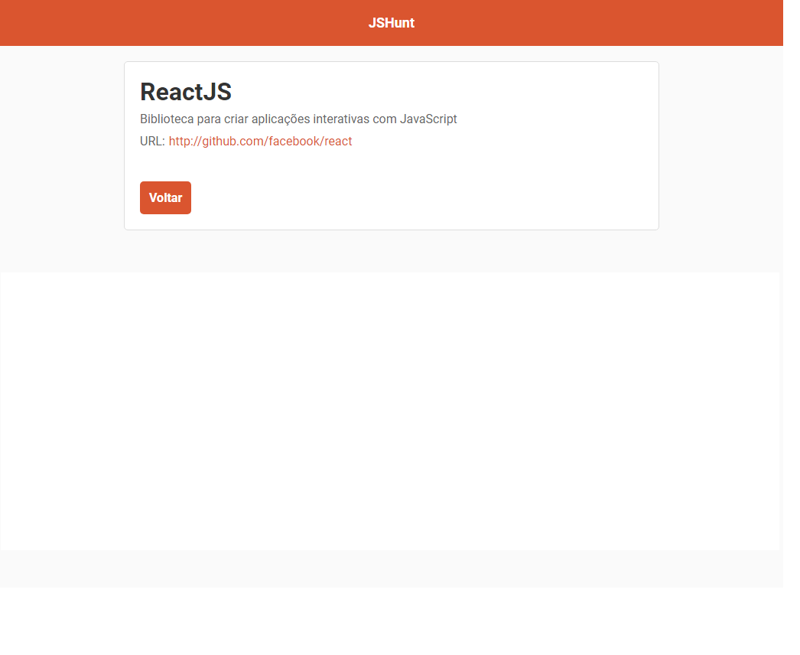

  <h1 align="center">JSHunt</h1>
 

 
 <h4 align="center">
  🚀 Curso de ReactJS da Rocketseat
</h4>

<h2>💻 Tecnologias utilizadas:</h2>
  
  - ReactJS
  - React-router-dom
  - Axios
  
 
  
  <h2 align="center">🔥 Um pouco sobre a aplicação:</h2>
  
  
  
  
  <h4 align="center">O Huntweb é uma aplicação baseada no Product Hunt, onde temos uma paginação de produtos e conseguimos ver os detalhes desses produtos individualmente, criada com ReactJS.</h4>
  
  <h1 align="center">Desenvolvido durante o curso de ReactJS da Rocketseat. 🚀</h1>

<h2>📱 Minhas redes sociais:</h2>

   
    
      
  
    
    
   
  
  
 

<h4>Feito com ❤ por Thalles Gabriel 🔥 
